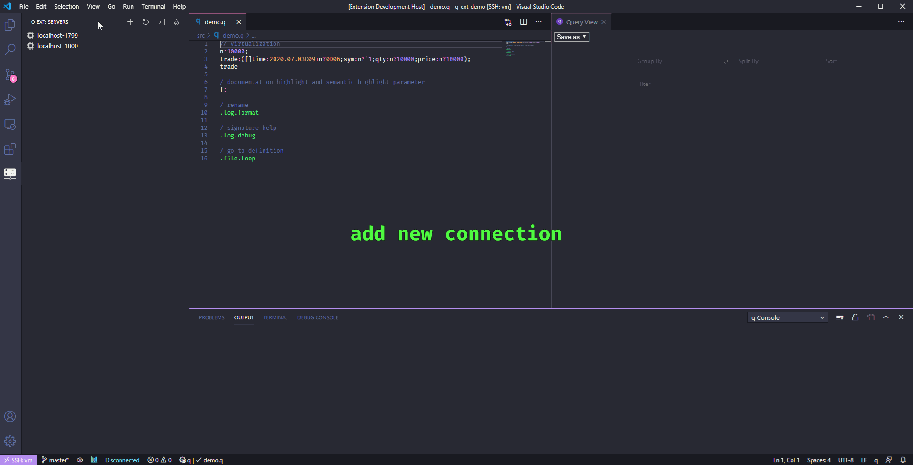
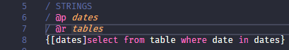
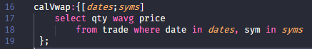

# q for Visual Studio Code

This extension provides kdb+\q language support.
- syntaxes
- server explorer
- virtualization powered by [perspective](https://perspective.finos.org/)
- language server powered by [tree-sitter](https://tree-sitter.github.io/tree-sitter/)
    - rename symbol (F2)
    - go to definition (F12)
    - go to reference (Shift+F12)
    - workspace symbol (Ctrl+T)
    - document highlight
    - document symbol (Ctrl+Shift+O)
    - completion (include all global namespace variables in the src folder)
    - completion resolve
    - signature help

See the [Changelog](https://github.com/jshinonome/vscode-q/blob/master/CHANGELOG.md).

[Submit an issue](https://github.com/jshinonome/vscode-q/issues).

## Configuration
Type <kbd>ctrl</kbd>+<kbd>,</kbd> to open Settings, search for following configuration and change the value.

| configuration           | type    | default value                    | description                           |
| ----------------------- | ------- | -------------------------------- | ------------------------------------- |
| q-ser.src.globsPattern  | array   | `["**/src/**/*.q"]`              | source folder to be included          |
| q-ser.src.ignorePattern | array   | `["**/build","**/node_modules"]` | folder to be excluded                 |
| q-ext.queryMode         | string  | `Console`                        | query mode, Console or Virtualization |
| q-ext.qview.theme       | string  | `dark`                           | q view in dark or light theme         |
| q-ext.qview.dense       | boolean | `false`                          | q view in dense mode                  |

## q Language Server(local server, no connection to the internet)
The server will analyze q source files in all 'src' folder. Insert ';' to indicated end of statement if necessary.

## Server Explorer
All q servers list in the q Server Explorer, and it is easy to switch server.

## Query Mode
Type <kbd>ctrl</kbd>+<kbd>shift</kbd>+<kbd>p</kbd> and call `kdb+/q ext: Toggle Query Mode` to switch Query Console.

### Query View(default)
The query view, powered by [perspective](https://perspective.finos.org/), can pivot and virtualize table data. In Query View mode, only table will be showed in a webview, but other result will still be in output. It will limit to 1000 rows when query a table, click the **flame** in **q Ext** panel , or call `kdb+/q ext: Toggle Unlimited Query`, to remove 1000 rows limit.

### Query Console
Output just like q console to an output channel. The console size is set to the same as q console. Use `system "c rows columns"` to change console size.

## Highlight Comments
Highlight `@p,@r` in comments, p stands for param, r stands for return.

## Semantic Highlight
Highlight parameters for functions. There shouldn't be any space between `{` and `[`.

## Formatter
Append space to `},],)` by formatting the file. Turn on `Editor: Format On Save` to automatically append space.

## Shortcuts
- <kbd>ctrl</kbd>+<kbd>q</kbd>: query current line
- <kbd>ctrl</kbd>+<kbd>r</kbd>: query selected line(s)

## Packages
Thanks to the following packages that makes this happen.
- [node-q](https://github.com/michaelwittig/node-q)
- [perspective](https://github.com/finos/perspective/)
- [tree-sitter](https://github.com/tree-sitter/tree-sitter)

## Reference
- https://github.com/simongarland/vim
- https://github.com/quintanar401/language-kdb-q
- https://github.com/tree-sitter/tree-sitter-javascript
- https://github.com/bash-lsp/bash-language-server
- https://github.com/RandomFractals/vscode-data-preview

## Recommended Packages
- [dracula/visual-studio-code](https://marketplace.visualstudio.com/items?itemName=dracula-theme.theme-dracula).
- [FiraCode](https://github.com/tonsky/FiraCode).

## License
[MIT](https://github.com/jshinonome/vscode-q/blob/master/LICENSE)