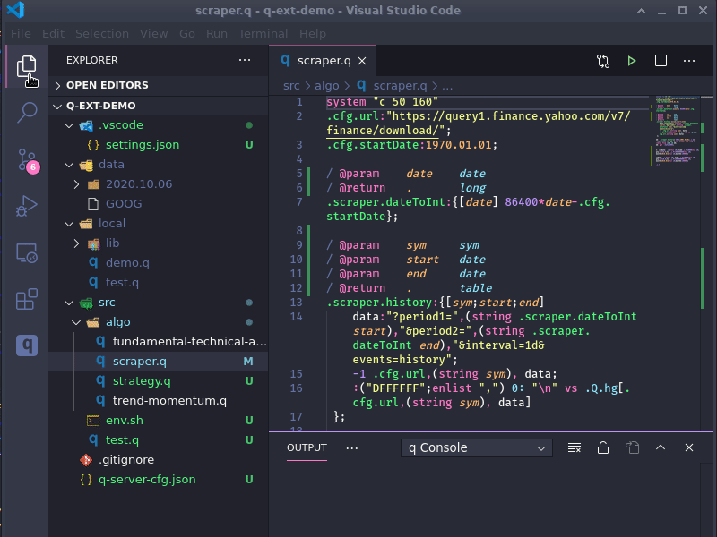
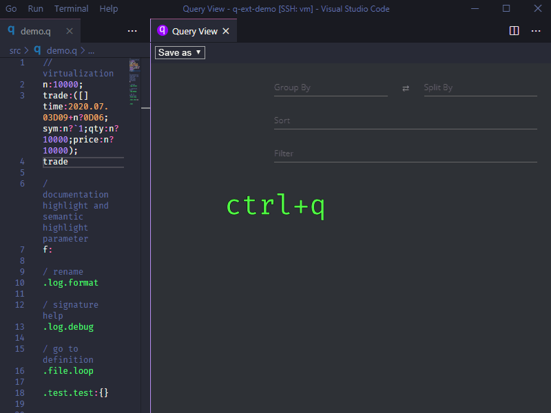
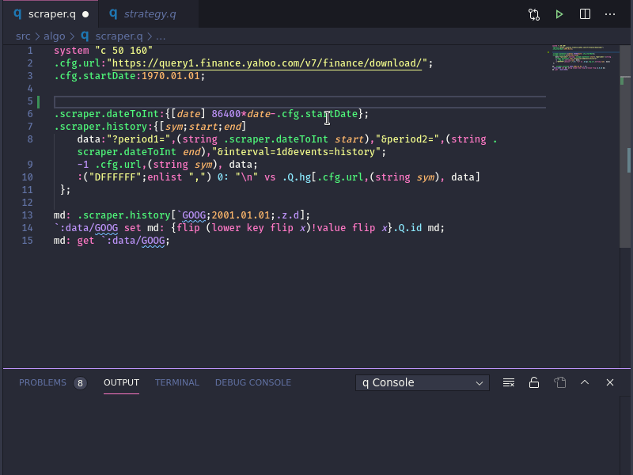
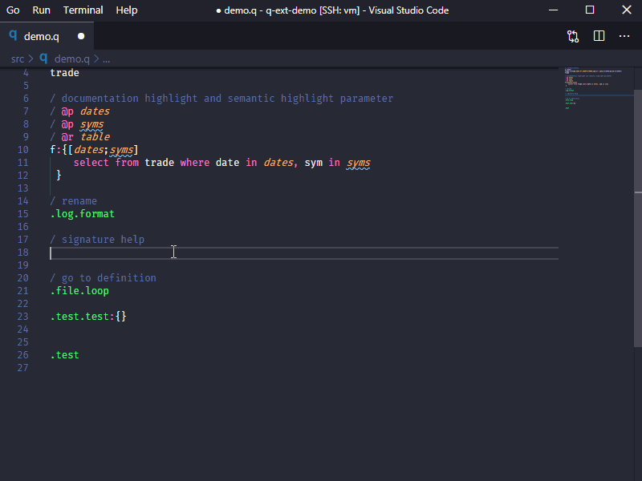

# q for vscode

[](https://marketplace.visualstudio.com/items?itemName=jshinonome.vscode-q)
[](https://marketplace.visualstudio.com/items?itemName=jshinonome.vscode-q)
[](https://marketplace.visualstudio.com/items?itemName=jshinonome.vscode-q)

This extension provides kdb+\q language support:

-   q syntaxes
-   server list group by tags
-   server explorer
-   query grid powered by [ag-grid-community](https://www.ag-grid.com/)
-   query virtualization powered by [perspective](https://perspective.finos.org/)
-   language server powered by [tree-sitter](https://tree-sitter.github.io/tree-sitter/)
    -   rename symbol (F2)
    -   go to definition (F12)
    -   go to reference (Shift+F12)
    -   workspace symbol (Ctrl+T)
    -   document highlight
    -   document symbol (Ctrl+Shift+O)
    -   completion
        -   identifiers defined in code
        -   identifiers defined on kdb+ process
        -   column names define on kdb+ process
    -   completion resolve
    -   signature help

See the [change log](https://github.com/jshinonome/vscode-q/blob/master/CHANGELOG.md).

[Submit an issue](https://github.com/jshinonome/vscode-q/issues).

## Demo

### Connect to a Server

Create a server and click to connect



### Query a Table



### Define a Function

-   Highlight `@[tag] [parameter name] [type]` in comments
-   Highlight parameters for functions. There shouldn't be any space between `{` and `[`.



### Call a Function

-   Autocomplete for defined identifiers and server identifiers.
-   Signature help for defined functions and server functions(type:100).



## Configuration

-   To configure globally, type <kbd>ctrl</kbd>+<kbd>,</kbd> to open Settings and change the following values.
-   To configure for workspace, type <kbd>ctrl</kbd>+<kbd>shift</kbd>+<kbd>p</kbd>, call `Preferences: Open Workspace Settings` and change the following values.

| configuration             | type    | default value                    | description                                 |
| ------------------------- | ------- | -------------------------------- | ------------------------------------------- |
| q-ser.src.globsPattern    | array   | `["**/src/**/*.q"]`              | source folder to be included                |
| q-ser.src.ignorePattern   | array   | `["**/build","**/node_modules"]` | folder to be excluded                       |
| q-ext.queryMode           | string  | `Console`                        | query mode, Console, Grid or Virtualization |
| q-ext.qview.dense         | boolean | `false`                          | q view in dense mode                        |
| q-ext.qgrid.decimals      | number  | `3`                              | decimals in q grid                          |
| q-ext.term.qBinary        | string  | `q`                              | q executable file or full path              |
| q-ext.term.envPath        | string  | ``                               | environment file relative or absolute path  |
| q-ext.expl.prevQueryLimit | string  | `5`                              | q explorer preview query limit              |

## q Language Server(local server, no connection to the internet)

The server will analyze q source files in all 'src' folder. Insert ';' to indicated end of statement if necessary.

## Server List

List servers, click to switch server. Generate tree structure from tags.

Special tag color:

-   green: dev, development
-   blue: uat
-   red: prd, prod.


## Server Explorer

List variables defined on the active server.

## Query Mode

Type <kbd>ctrl</kbd>+<kbd>shift</kbd>+<kbd>p</kbd> and call `kdb+/q ext: Toggle Query Mode` to switch Query Console.

### Query View

The query view, powered by [perspective](https://perspective.finos.org/), can pivot and virtualize table data. In Query View mode, only table will be showed in a webview, but other result will still be in output. It will limit to 1000 rows when query a table, click the **flame** in **q Ext** panel , or call `kdb+/q ext: Toggle Unlimited Query`, to remove 1000 rows limit.

### Query Grid

The query grid, powered by [ag-grid-community](https://www.ag-grid.com/), can filter and sort table data. In Query Grid mode, only table will be showed in a webview, but other result will still be in output. It will limit to 1000 rows when query a table, click the **flame** in **q Ext** panel , or call `kdb+/q ext: Toggle Unlimited Query`, to remove 1000 rows limit.

### Query Console(default)

Output just like q console to an output channel. The console size is set to the same as q console. Use `system "c rows columns"` to change console size.

## Formatter

Append space to `},],)` by formatting the file. Turn on `Editor: Format On Save` to automatically append space.

## Shortcuts

-   <kbd>ctrl</kbd>+<kbd>q</kbd>: query current line
-   <kbd>ctrl</kbd>+<kbd>r</kbd>: query selected line(s)
-   <kbd>ctrl</kbd>+<kbd>shift</kbd>+<kbd>q</kbd>: send current line to active terminal
-   <kbd>ctrl</kbd>+<kbd>shift</kbd>+<kbd>r</kbd>: send selected line(s) to active terminal

## Version Compatibility

To use this extension in an earlier version of vscode.

1. git clone this repo
2. change 'vscode' of 'engine' in the package.json and '@types/vscode' of devDependencies to target version 1.\*\*

```
...
	"engines": {
		"vscode": "^1.**.*"
	},
...
	"devDependencies": {
...
		"@types/vscode": "^1.**.*",
...
	},
```

3. run the following commands from this repo folder to get a earlier version compatible package

```
npm i
sudo npm i -g vsce
vsce package
```

## Tips

### Disable Word Wrap in q Console of Output

Type <kbd>ctrl</kbd>+<kbd>shift</kbd>+<kbd>p</kbd>, call `Open Setting(Json)`, and add following configuration.

```
    "[Log]": {
        "editor.wordWrap": "off"
    }
```

## Packages

Special thanks to the following packages.

-   [node-q](https://github.com/michaelwittig/node-q)
-   [perspective](https://github.com/finos/perspective/)
-   [tree-sitter](https://github.com/tree-sitter/tree-sitter)
-   [ag-grid-community](https://www.ag-grid.com/)

## Reference

-   https://github.com/simongarland/vim
-   https://github.com/quintanar401/language-kdb-q
-   https://github.com/tree-sitter/tree-sitter-javascript
-   https://github.com/bash-lsp/bash-language-server
-   https://github.com/RandomFractals/vscode-data-preview

## Recommended Packages

-   [Theme: Dracula](https://marketplace.visualstudio.com/items?itemName=dracula-theme.theme-dracula)
-   [Fira Code](https://github.com/tonsky/FiraCode)

## License

[MIT](https://github.com/jshinonome/vscode-q/blob/master/LICENSE)
