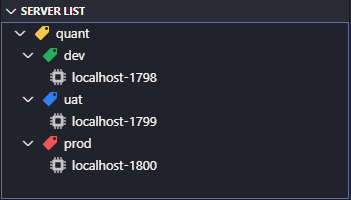

# vscode-q

[](https://marketplace.visualstudio.com/items?itemName=jshinonome.vscode-q)
[](https://marketplace.visualstudio.com/items?itemName=jshinonome.vscode-q)
[](https://marketplace.visualstudio.com/items?itemName=jshinonome.vscode-q)
[](https://gitter.im/vscode-q/community?utm_source=badge&utm_medium=badge&utm_campaign=pr-badge&utm_content=badge)

This extension provides kdb+\q language support:

- q syntaxes
- q notebook(\*.qnb)
- server list group by tags
- server explorer
- query grid powered by [ag-grid-community](https://www.ag-grid.com/) & [chart.js](https://www.chartjs.org/)
- query visualization powered by [perspective](https://perspective.finos.org/)
- language server powered by [tree-sitter](https://tree-sitter.github.io/tree-sitter/)
  - rename symbol (F2)
  - go to definition (F12)
  - go to reference (Shift+F12)
  - workspace symbol (Ctrl+T)
  - document highlight
  - document symbol (Ctrl+Shift+O)
  - completion
    - identifiers defined in code
    - identifiers defined on kdb+ process
    - column names define on kdb+ process
  - completion resolve
  - signature help
  - semantic highlight
  - call hierarchy

See the [change log](https://github.com/jshinonome/vscode-q/blob/master/CHANGELOG.md).

## Demo

[](https://www.youtube.com/watch?v=-k6lx5ePo70)

[Introduction to vscode-q](https://www.youtube.com/watch?v=-k6lx5ePo70)

## Configuration

- To configure globally, type <kbd>ctrl</kbd>+<kbd>,</kbd> to open Settings and change the following values.
- To configure for workspace, type <kbd>ctrl</kbd>+<kbd>shift</kbd>+<kbd>p</kbd>, call `Preferences: Open Workspace Settings` and change the following values.

| configuration                      | type    | default value                    | description                                |
| ---------------------------------- | ------- | -------------------------------- | ------------------------------------------ |
| q-server.sourceFiles.globsPattern  | array   | `["**/src/**/*.q"]`              | source folder to be included               |
| q-server.sourceFiles.ignorePattern | array   | `["**/build","**/node_modules"]` | folder to be excluded                      |
| q-client.queryMode                 | string  | `Console`                        | query mode, Console, Grid or Visualization |
| q-client.queryGrid.decimals        | number  | `3`                              | decimals in q grid                         |
| q-client.term.qBinary              | string  | `q`                              | q executable file or full path             |
| q-client.term.envPath              | string  | `''`                             | environment file relative or absolute path |
| q-client.expl.prevQueryLimit       | string  | `5`                              | q explorer preview query limit             |
| q-client.expl.autoRefresh          | boolean | `false`                          | q explorer auto refresh                    |
| q-client.expl.excludedNamespaces   | array   | `["q","Q","j","o","h"]`          | namespaced to be excluded from q explorer  |
| q-client.output.autoClear          | boolean | `false`                          | Auto Clear Output                          |
| q-client.output.includeQuery       | boolean | `false`                          | Include Query in Output                    |
| q-client.output.consoleSize        | string  | `'36 180'`                       | Console Size for Output                    |

## q Language Server(local server, no connection to the internet)

The server will analyze q source files in all 'src' folder. Insert ';' to indicated end of statement if necessary.

## Notebook

Files with postfix \*.qnb are using notebook feature. There are 2 output mode for q notebook, switch to following query mode for different output format

- q Console -> notebook console
- q Grid -> notebook html
- q Visualization -> notebook html

## Server List

List servers, click to switch server. Generate tree structure from tags.

Special tag color:

- green: dev, development
- blue: uat
- red: prd, prod.



## Discovery Server

The url should be a REST API endpoint, which returns a list of `{host:string, port:number, label:string}`. The returned list will be added to Server List, but it won't be saved.

## Server Explorer

List variables defined on the active server.

## Query Mode

Type <kbd>ctrl</kbd>+<kbd>shift</kbd>+<kbd>p</kbd> and call `kdb+/q ext: Switch Query Mode` to switch Query Console.

### Query View

The query view, powered by [perspective](https://perspective.finos.org/), can pivot and virtualize table data. In Query View mode, only table will be showed in a webview, but other result will still be in output. It will limit to 1000 rows when query a table, click the **flame** in **q Ext** panel , or call `kdb+/q ext: Toggle Unlimited Query`, to remove 1000 rows limit. Be noted that, Query View only support millisecond precision. Use **Query Grid**, if you need nanosecond precision.

### Query Grid

The query grid, powered by [ag-grid-community](https://www.ag-grid.com/) and [chart.js](https://www.chartjs.org/), can filter and sort table data. In Query Grid mode, only table will be showed in a webview, but other result will still be in output. It will limit to 1000 rows when query a table, click the **flame** in **q Ext** panel , or call `kdb+/q ext: Toggle Unlimited Query`, to remove 1000 rows limit.

### Query Console(default)

Output just like q console to an output channel. The console size is set to the same as q http size. Use `system "C rows columns"` to change console size.

### History View

Record query histories.

## Commands

### Connect q Sever

Type <kbd>ctrl</kbd>+<kbd>shift</kbd>+<kbd>p</kbd> and call `kdb+/q ext: Connect to q Server` to connect to a q server.

## Formatter

Append space to `},],)` by formatting the file. Turn on `Editor: Format On Save` to automatically append space.

## Shortcuts

- <kbd>ctrl</kbd>+<kbd>q</kbd>: query current line
- <kbd>ctrl</kbd>+<kbd>r</kbd>: query selection
- <kbd>ctrl</kbd>+<kbd>e</kbd>: query block
- <kbd>ctrl</kbd>+<kbd>shift</kbd>+<kbd>q</kbd>: send current line to terminal
- <kbd>ctrl</kbd>+<kbd>shift</kbd>+<kbd>r</kbd>: send selection to terminal
- <kbd>ctrl</kbd>+<kbd>shift</kbd>+<kbd>e</kbd>: send block to terminal

To change shortcuts

1. type <kbd>ctrl</kbd>+<kbd>shift</kbd>+<kbd>p</kbd>
2. input "shortcut"
3. open the Keyboard Shortcuts
4. search for "kdb+".

## Version Compatibility

To use this extension in an earlier version of vscode.

1. git clone this repo
2. change 'vscode' of 'engine' in the package.json and '@types/vscode' of devDependencies to target version 1.\*\*

```
...
	"engines": {
		"vscode": "^1.**.*"
	},
...
	"devDependencies": {
...
		"@types/vscode": "^1.**.*",
...
	},
```

3. run the following commands from this repo folder to get a earlier version compatible package

```
npm i
sudo npm i -g vsce
vsce package
```

## Tips

### Enable Auto Scrolling for Output Channel

1. Type <kdb>ctrl</kdb>+<kdb>comma(,)</kdb>, open Settings, disable `Output>Smart Scroll`.
2. Turn on Auto Scrolling by clicking a small locker icon on the right top of output channel.

### Disable Word Wrap in q Console of Output

Type <kbd>ctrl</kbd>+<kbd>shift</kbd>+<kbd>p</kbd>, call `Open Setting(Json)`, and add following configuration.

```
    "[Log]": {
        "editor.wordWrap": "off"
    }
```

### No Color in q Output

There may be a conflict with other extensions. Disable or uninstall them and try again.

### Enable Highlight for Attention And TODO of comments


Type <kbd>ctrl</kbd>+<kbd>shift</kbd>+<kbd>p</kbd>, call `Open Setting(Json)`, and add following configuration.

```
    "editor.tokenColorCustomizations": {
        "textMateRules": [
            {
                "scope":"comment.line.attention",
                "settings": {
                    "fontStyle": "italic",
                    "foreground": "#B71C1C"
                }
            },
            {
                "scope":"comment.line.todo",
                "settings": {
                    "fontStyle": "italic",
                    "foreground": "#2E7D32"
                }
            }
        ]
    }
```

### Special Comment

Querying comment line `/<=> quant,prod,local-1800` will connect to `quant,prod,local-1800`.
Type <kbd>ctrl</kbd>+<kbd>shift</kbd>+<kbd>p</kbd>, call `kdb+/q ext Insert Active Connection Label` to insert active connection label.

### Customized Authentication

refer to [vscode-q-auth](https://github.com/jshinonome/vscode-q-auth)

## Packages

Special thanks to the following packages.

- [node-q](https://github.com/michaelwittig/node-q)
- [perspective](https://github.com/finos/perspective/)
- [tree-sitter](https://github.com/tree-sitter/tree-sitter)
- [ag-grid-community](https://www.ag-grid.com/)

## Reference

- https://github.com/simongarland/vim
- https://github.com/quintanar401/language-kdb-q
- https://github.com/tree-sitter/tree-sitter-javascript
- https://github.com/bash-lsp/bash-language-server
- https://github.com/RandomFractals/vscode-data-preview

## Recommended Packages

- [Theme: Dracula](https://marketplace.visualstudio.com/items?itemName=dracula-theme.theme-dracula)
- [Font : Fira Code](https://github.com/tonsky/FiraCode)

## Contributing

If you'd like to contribute to this extension, please read the [contributing guidelines](https://github.com/jshinonome/vscode-q/blob/master/CONTRIBUTING.md).

## License

[MIT](https://github.com/jshinonome/vscode-q/blob/master/LICENSE)
